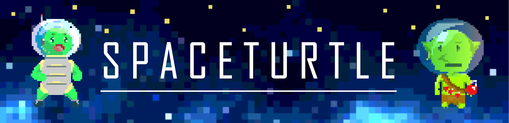
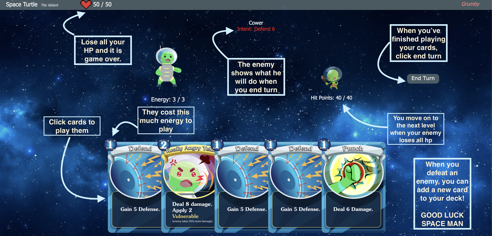
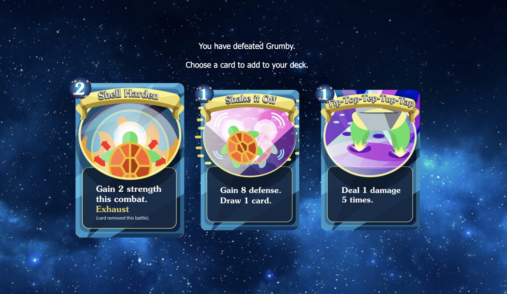

# A light deckbuilding roguelite using vanilla Javascript, HTML and CSS.
[Try the game for yourself!](https://kunzels.github.io/SpaceTurtle/)
## Functionality and MVP

  * Play cards to boost your powers, attack enemies, or create defenses.
  * Add cards to your deck after defeating an enemy.    
  * Fight different space... goblins! 

## Basic gameplay



* The user is shown exactly what the enemy will do on their turn, attack, defend, and precise values
* The user chooses which cards to play from cards drawn each turn. 
* Attacking lowers the enemy HP, while defending adds block to your character, removed each turn
* After defeating an enemy, you can choose a card to add to your deck.



## Challanges

One interesting challange from this project was making it so enemies and cards could be easilly added. I wanted to make sure that if I wanted to add a new card or enemy it wouldn't be too troublesome.  Now, making a new card or enemy is only limited by the time it takes to make the art and voicelines. Adding a card, enemy, or concept is a pretty quick refactor of the code.

Another challange was getting the deck to shuffle accuratly, and to make cards know what they will do.  I was able to make exhaust cards work as well by moving around these objects.  
<!-- ```javascript
let enemy = {
        name: "Grumby", maxHealth: 40, hitPoints: 40, defense: 0, strength: 0, vulnerable: 0, weak: 0, moves: [
            { name: 'Bop', impact: "attack", attack: 6, sound:`./src/sounds/grumbyAttack` },
            { name: 'Cower', impact: "defend", defense: 6, sound:`./src/sounds/grumbyDefend` }
        ]}
    const enemies = [
        { name: "Grumby's Older Brother, Charles", 
                    maxHealth: 60, 
                    hitPoints: 60, 
                    defense: 0, 
                    strength: 0, 
                    vulnerable: 0, 
                    weak: 0,           
                    moves: [
                        { name: "'Where's my brudda?'", impact: "defend", defense: 15 },
                        { name: "'I'm bop ya!'", impact: "attack", attack: 8 },
                        { name: "'I'm smash ya!'", impact: "attack", attack: 12 },
                        { name: "'I'm take a break!'", impact: "defend", defense: 10 }
                    ]
        },
        { name: "The Goblin Kings Assassin",
                maxHealth: 120,
                hitPoints: 120,
                defense: 0,
                strength: 0,
                vulnerable: 0,
                weak: 0,
                moves: [
                    {name: "'You've been causing problems...'", impact: "embolden", defense: 15, gainStrength: 1 },
                    {name: "'Sharpening my blades...'", impact: "embolden", defense: 5, gainStrength: 2 },
                    {name: "'You will pay for your incursion...'", impact: "embiggen", attack: 1, gainStrength: 1 },
                    {name: "'These blades only get stronger...'", impact: "embiggen", attack: 1, gainStrength: 1 },
                    {name: "' Better run kid...'", impact: "embiggen", attack: 1, gainStrength: 1 },
                    {name: "' huh...'", impact: "defend", defense: 20 }
                ]
        },
``` -->

## Future Directions
    
  ### Though this is a project to show programming ability, if I were to continue working on it, I would look into features present in popular deckbuilding roguelite games (ie: Slay The Spire), such as: 

  * Display deck and discard.
  * Add gold, shops, card removal, stores, healing.
  * A map to choose your path.
  * Multiple enemies.
  * Upgrade cards.
  * Better animations.
  * Card dragging and releasing.
  * Etc.

### WireFrame
  * The game will consist of a single battle screen and static placements for enemies and players. You can play cards from your hand to activate them. Enemy will display intent and lower HP when dealt damage. Cards are drawn and discarded, and shuffled when the draw pile is empty. 


