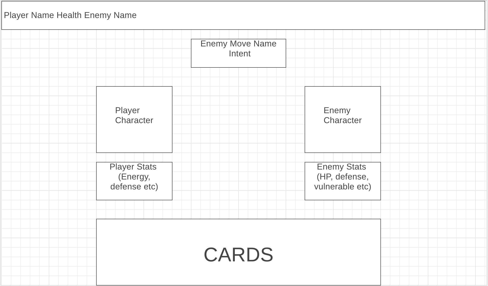

# Space Turtle Origins
# A light deckbuilding roguelite to practice vanilla JS

## Functionality and MVP

  * Play cards to boost your powers, attack enemies, or create defenses.
  * Add cards to your deck after defeating an enemy.    
  * Fight different... shapes! 

## Basic gameplay

* The user is shown exactly what the enemy will do on their turn, attack, defend, and precise values
* The user chooses which cards to play from cards drawn each turn. 
* Attacking lowers the enemy HP, while defending adds block to your character, removed each turn
* After defeating an enemy, you can choose a card to add to your deck.

### WireFrame
  * The game will consist of a single battle screen and static placements for enemies and players. You can drag cards from your card area onto an enemy to activate them. Enemy will display intent and lower HP when dealt damage. Cards are drawn and discarded, and shuffled when the draw pile is empty. 

  * Add image uploading, and banner images
  * Add followers and following
  * Add tags
  * Add addional splash page features( New albums, featured artists etc.)
  * Ability to purchase
  * CSS improvements